# Introduction

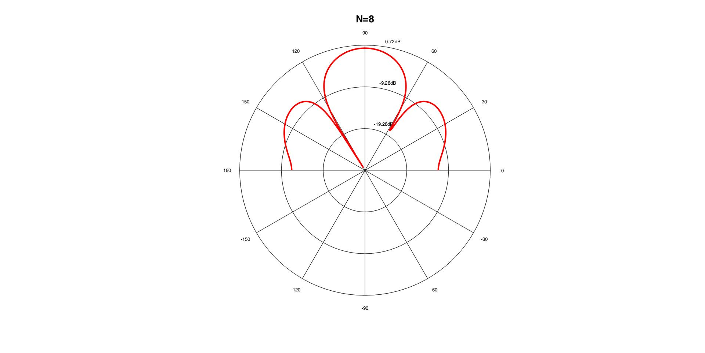{width="3.7916666666666665in"
height="3.8645833333333335in"}

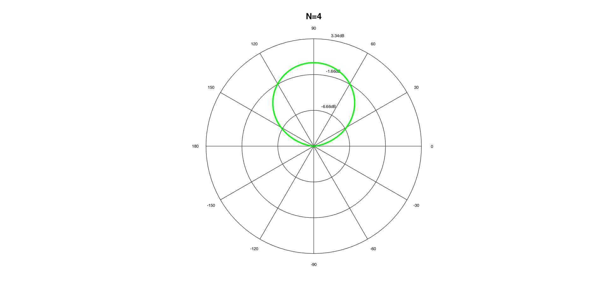{width="3.75in"
height="3.9479166666666665in"} 

The signal comes from an angle $\theta_s=90^\circ$ and the number of microphones changes. The resulting plots are::

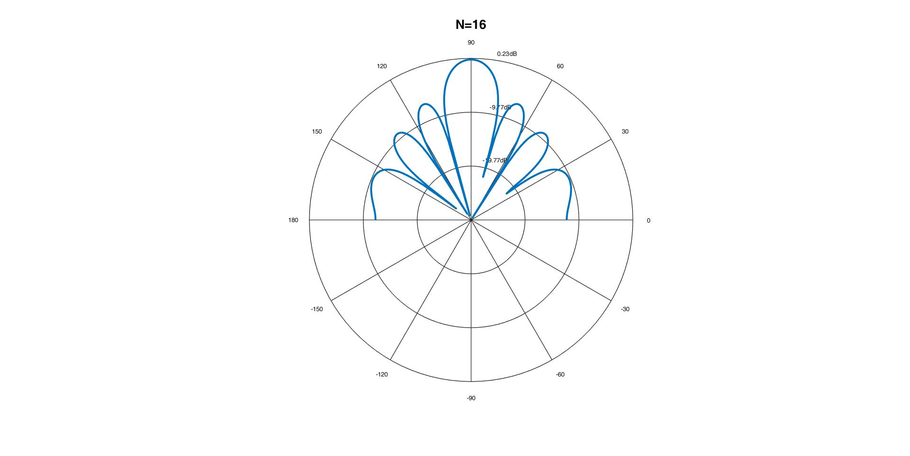{width="4.194444444444445in"
height="4.252777777777778in"}

First, it becomes obvious that the beamformer has an axis of maximum at an angle of $\theta_{} = 90{^\circ}$. To be more specific, for  $\theta_{} = 90{^\circ}$, we have that $Β= 1$ and, thus,  ${10\log}_{10}B = 0\ dB$. Moreover, the beamformer is able to recognize the steering direction, which is apparent from the lack of grating lobes in the above plots. From a mathematical standpoint, this can be explained as:

$$
\lambda = \ \frac{c}{f} = \frac{340\frac{m}{s}}{2Khz} = 0.17m = 17cm \\
\implies d = 4cm < \ \frac{\lambda}{1 + \left| cos(\theta_{s}) \right|} = \lambda = 17\ cm
$$
Hence, there is no spatial aliasing.

The input signal comes from an angle of $\theta_{s} = 90{^\circ}$ and the distances of the microphone changes. As before, no spatial aliasing can be observed. This is explained both from the lack of grating lobs and by the spatial sampling theorem: 
$$
4cm < 8cm < 16cm < \ \frac{\lambda}{1 + \left| \cos(\theta_{s}) \right|} = \lambda = 17\ cm.
$$

It is worth noting that only for $d = 4cm$ and $d = 8\text{cm}$, the microphone distance ensures that the sampling theorem is satisfied. To be more specific, the lack of spatial aliasing on all 3 cases is due to the extreme values of the steering direction. Should $\theta_s$ vary, the sampling theorem would have to satisfy the more general equation:
$$
d < \ \frac{\lambda}{2} = 8.5cm
$$
Hence, for $d = 16\text{cm}$ spatial aliasing occurs for some values of the angle $\theta_{s}.$ For example, let us consider the magnitude of the delay-and-sum beamformer in the case of $d = 16\ cm,\ \theta_{s} = \frac{\pi}{3}\ $:

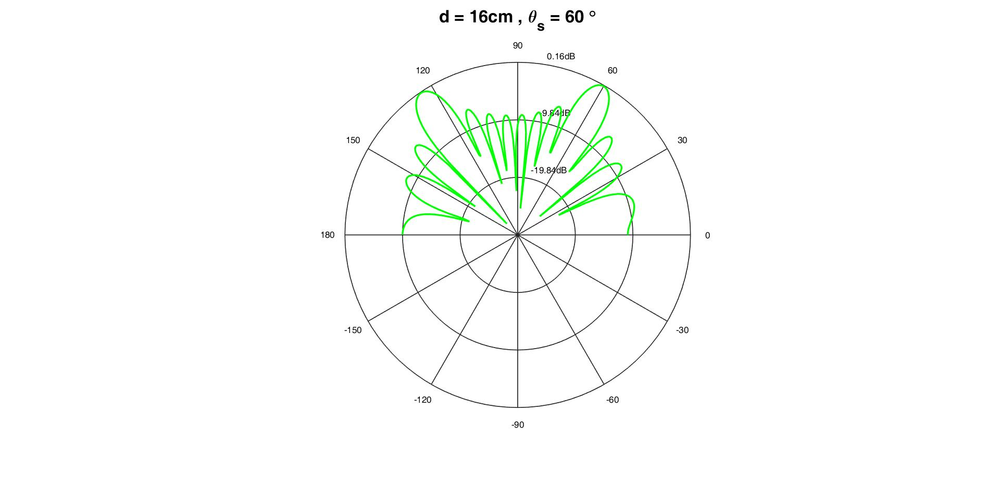{width="4.332638888888889in"
height="4.977083333333334in"}

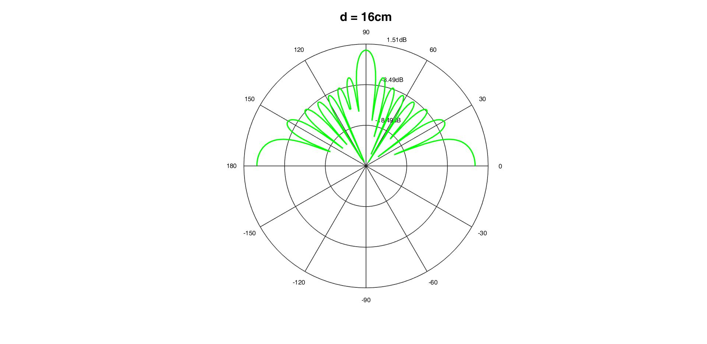{width="4.5in"
height="5.0625in"}

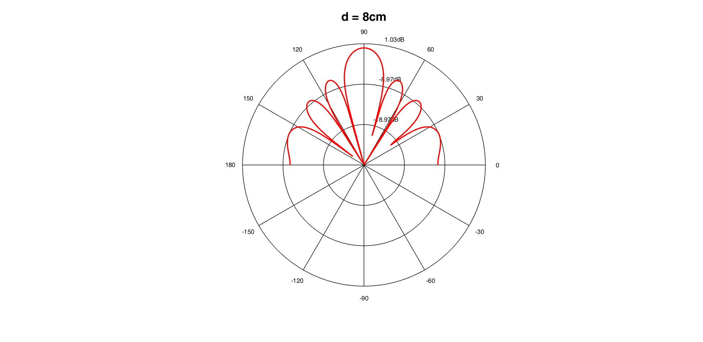{width="4.322916666666667in"
height="4.740277777777778in"}

{width="3.963888888888889in"
height="4.745833333333334in"}

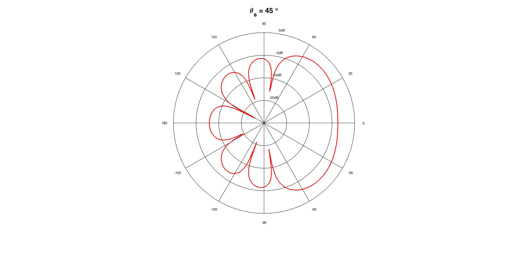{width="4.179861111111111in"
height="4.846527777777778in"}

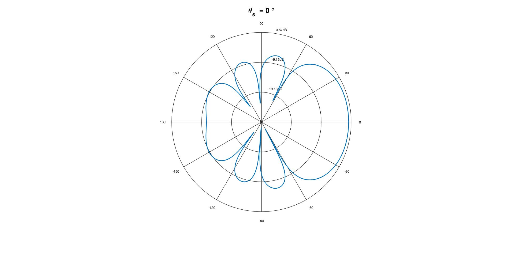{width="3.7784722222222222in"
height="4.115972222222222in"}

The distance between and the number of microphones remain constant. In contrast, the steering direction varies. We have proved that for $d = 4cm,$ spatial aliasing does not occur for any angle $\theta_{s}$. The resulting polar plots are:

{width="4.046511373578303in"
height="4.5974792213473314in"}

The effect of the angle $\theta_{s}$ becomes apparent: the primary lobe is in the stering direction. However, this also applies for the direction ${- \theta}_{s},\ $ due to the symmetry of the sine wave. The steering direction occurs for the angle $\theta$:
$$
\left| Β(\omega,\theta) \right| = 1\implies{10\log}_{10}\left| Β(\omega,\theta) \right| = 0\ dB.
$$

# Part 1

Delay-And-Sum Beamforming
--------------------------------------

### Theory

A delay-and-sum beamformer is implemented for the given simulated signal. We have an array with $N=7$ microphones that record a signal produced by two sources. The distance between the microphones is equal to  $d = 4cm$. One source produces a sound signal at an angle $\theta_{} = 45{^\circ}$ while the other produces a noise signal at an angle $\theta_{} = 135{^\circ}$. We are aware that the noise is bandpass signal whose energy lies on the frequencies $f\  \in \lbrack 500Hz\ ,\ 2.5KHz\rbrack$ and that it is not correlated with the source signal. Each microphone receives the signal $\text{sensor}_n,n\in  \{ 1,2,3,4,5,6,7\}$, which corresponds to the noise signal. Moreover, the center microphone $(n-4)$ captures the sound signal as well. Due to the spatial arrangement of the microphones, each one captures the noise signal with a time delay:
$$
\tau_{n} = \frac{{}^{T}{}_{n}}{c} = - \frac{\left( n - \frac{N - 1}{2} \right)\text{dcosθ}}{c} = 0\ \ \ \ \ \ \forall\ n\mathbb{\in N}
$$
where $Ν =  7, d = 0.04m, \theta  = 135^\circ \text{ and } c  = 340\frac{m}{s}$. In other words,   $sensor_n(t)=f_{n}\ (t - \tau_{n}).$                                           Thus,we ought to adjust each signal before adding them.  We observe that the difference between the clean signal and the beamformer output is a noisy signal. Thus, the validity of this algorithm is verified experimentally.

The resulting plots are:

{width="7.5in"
height="3.7618055555555556in"}

{width="7.5in"
height="3.7618055555555556in"}

{width="7.5in"
height="3.7618055555555556in"}

The beamformer's output has much less noise compared with the signal captured by the center microphone. The respective spectrograms are:

{width="7.5in"
height="3.7618055555555556in"}

{width="7.5in"
height="3.7618055555555556in"}

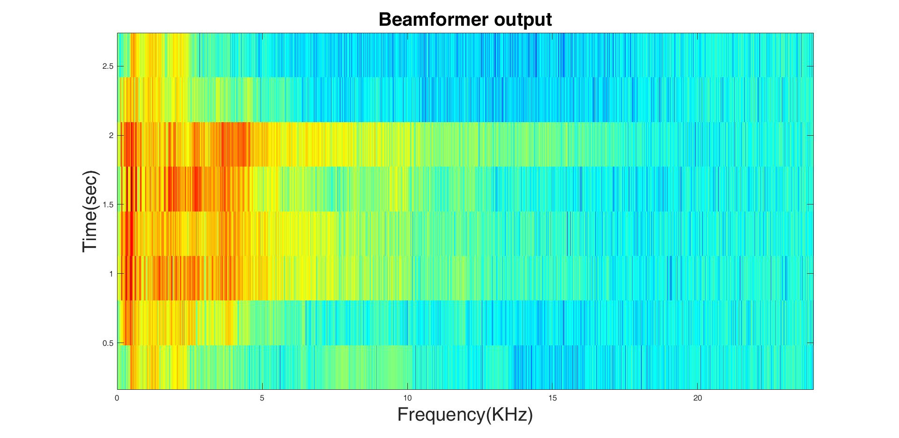{width="7.5in" height="3.65625in"}

### Results

The SNRs pertaining to the center microphone and the beamformer are calculated. Bear in mind that we have the clean signal.

-   $\text{SNR}_{\text{sensor}\_ 4} = 3.000000003351313\ \text{dB}$

-   $\text{SNR}_{\text{beamformer}\_\text{output}} = 17.526403761984955\ \text{dB}$

Quantitatively, we also conclude that the beamformer significantly improves on the original signal.

Single-channel Wiener filtering
---------------------------------------------

Using the `pwelch` function we calculate the response:

{width="7.5in"
height="3.7618055555555556in"}

We calculate the speech distortion:

$$
n_{\text{sd}}\  = \ |1\ –\ H_{w}(\omega)|²
$$
and present the following logarithmic plot for $f \in [0\text{kHz},\ 8\text{kHz}]$. The frequency interval $f \in [500\text{Hz},\ 2.5\text{kHz}]$, i.e. the interval where sound is mostly observed, is characterized with significant distortions. 

{width="7.5in"
height="3.7618055555555556in"}

A power spectrum analysis yields the following results:

{width="7.5in" height="3.65625in"}

We also compare the power spectrum of this method with the beamformer.

{width="7.5in" height="3.65625in"}

Both the beamformer and the Wiener filter closely approximate the clean signal across the frequency spectrum. However, the beamformer outperforms the Wiener filter on the human frequency range 

$f\in [0,4]\text{KHz}$,  whereas the opposite is true for higher frequencies, which correspond to the noise.

Quantitatively:

-   $\text{SNR}_{sensor\_ 3} = - 3.066603537988252\ dB$

-   $\text{SNR}_{Wiener\_ output} = - 1.254792466421344\ dB$

-   $\text{SNR}_{beamformer\_ output} = 11.803983892140966\ dB$.

# Part 2

Delay-And-Sum Beamforming
--------------------------------------

### Theory

Just as in part 1, the output of the beamformer is calculated. However, the angle is now $\theta = 90{^\circ}\ $ and our calculations are simplified:
$$
\tau_{n} = \frac{{}^{T}{}_{n}}{c} = - \frac{\left( n - \frac{N - 1}{2} \right)\text{dcosθ}}{c} = 0\ \ \ \ \ \ \forall\ n\mathbb{\in N}
$$
In other words, there is no delay and the beamformer's output is simply the mean of the captured signals. The resulting plots are:

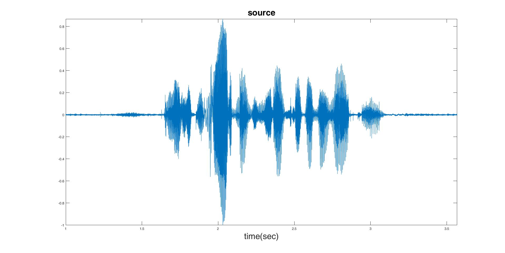{width="7.5in"
height="3.7618055555555556in"}

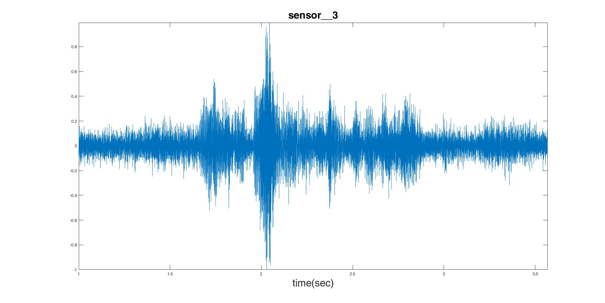{width="7.5in"
height="3.7618055555555556in"}

{width="7.5in"
height="3.7618055555555556in"}

The beamformer denoises the signal. However, the improvement is not as vast as before.

{width="7.5in"
height="3.7618055555555556in"}{width="7.5in"
height="3.7618055555555556in"}

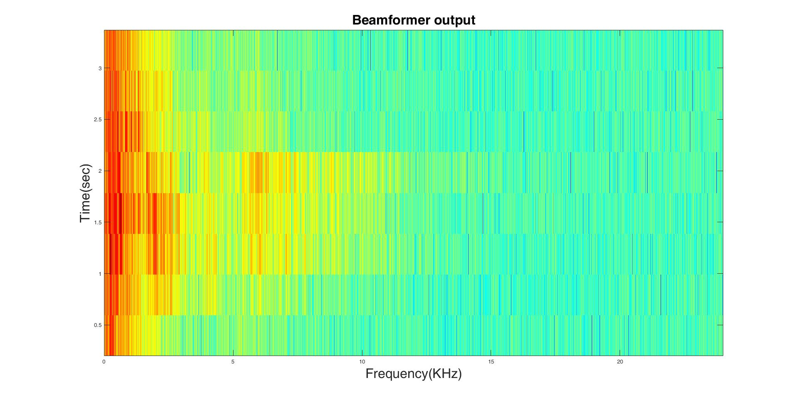{width="7.5in"
height="3.7618055555555556in"}

Just as expected, the energy is concentrated on the human frequency range $f\  \in \lbrack 0KHz,4KHz\rbrack$.  The beamformer has significanly reduced the noise outside of this range.

### Results

Two methods are employed in the calculation of the SSNR; one where noise and signal are considered uncorrelated and one without this assumption. In both cases, noise is considere to be stationary. We have chosen the first $L$ samples, corresponding to $30\text{ms}$, as noise, since the voice is heard after that brief window. Also,  $\text{threshold} = - 20dB.$ Then:
$$
SSNR = \frac{1}{M}\sum_{m = 0}^{M - 1}{{10log}_{10}\frac{\sum_{n = Lm}^{Lm + L - 1}{s^{2}\left( n \right)}}{\sum_{n = Lm}^{Lm + L - 1}{v^{2}\left( n \right)}}}\
$$

$$
\text{SSNR}_{\text{correlated}} = \frac{1}{M}\sum_{m = 0}^{M - 1}{SNR(s,v)} = \frac{1}{M}\sum_{m = 0}^{M - 1}{SNR(x - v,v)}
$$

or

$$
\text{SSNR}_{\text{uncorrelated}} = \frac{1}{M}\sum_{m = 0}^{M - 1}{{10log}_{10}\frac{L \bullet P_{s}}{L \bullet P_{v}}}
$$

$$
\text{SSNR}_{\text{uncorrelated}} = \frac{1}{M}\sum_{m = 0}^{M - 1}{{10log}_{10}\frac{L \times P_{x} - L{\times P}_{v}}{L \times P_{v}}}
$$

$$
\text{SSNR}_{\text{uncorrelated}} = \frac{1}{M}\sum_{m = 0}^{M - 1}{{10log}_{10}\frac{\sum_{n = Lm}^{Lm + L - 1}{x^{2}\left( n \right) - \sum_{n = Lm}^{Lm + L - 1}{v^{2}\left( n \right)}}}{\sum_{n = Lm}^{Lm + L - 1}{v^{2}\left( n \right)}}}
$$
These methods yield the following results:

-   Method 1: general
    - $\text{SSNR}_{sensor\_ 4} = 5.252007842436720dB$
    - $\text{SSNR}_{beamformer\_ output} = 6.393851744270863\ dB$

- Method 2: signal and noise  **uncorrelated** 
  - $\text{SSNR}_{sensor\_ 4} = - 0.603867507284823\ dB$
  - $\text{SSNR}_{beamformer\_ output} = 1.211737709257576\ dB$

In both cases, the improvement lies between $1\ $and $ 2\ \text{dB}.$ 

Single-channel Wiener filtering
--------------------------------------------

### Theory

The Wiener filter is applied to the output of the beamformer, in oder to further improve the signal. The `buffer` function is used where the following parameters are selected:  $\text{window} = 30 \text{ms}$ and $\text{overlap}=75\%$. This method uses square Hamming windows. The power spectrum is computed via the `pwelch` function. The noise is assumed to be stationary and uncorrelated with the signal. The resulting windows are added with the overlap-add method. The resulting plots are:

{width="7.5in"
height="3.7618055555555556in"}

{width="7.5in"
height="3.7618055555555556in"}

{width="7.5in"
height="3.65625in"}{width="7.5in"
height="3.65625in"}

 At first glance, it seems like the Wiener filter adds noise. However, by using SSNR to compare, we conclude that the output signal is an improvement. Moreover, using the human ear as a comparison tool, we observe that the output signal is "cleaner" but has a robotic effect. This is not unexpected, considering that even though the Wiener filter denoises, it adds some distortion.

{width="7.5in"
height="3.7618055555555556in"}

{width="7.5in"
height="3.7618055555555556in"}

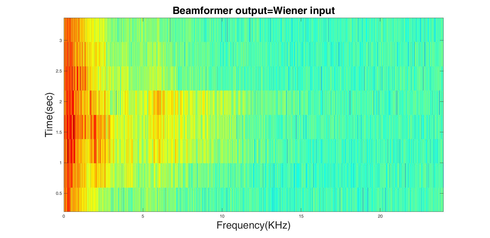{width="7.5in" height="3.65625in"}

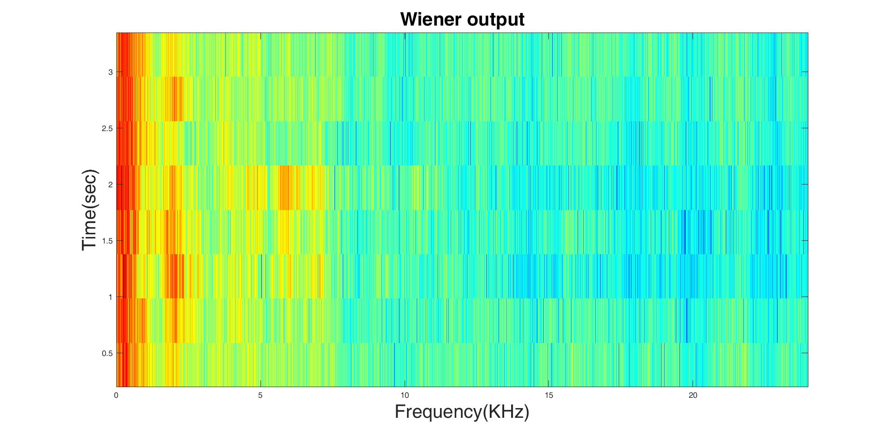{width="7.5in" height="3.65625in"}

The Wiener filter weakens the signal in high frequencies $(f > 10Khz)$. Comparing the spectrograms and focusing on high frequencies where voice signals have low energy, we can observe that the clean signal and the output of the system are very similar.

### Results

We assume that the noisy signal and the noise are uncorrelated. Then:
-   $\text{SSNR}_{Wiener\_ input} = 1.211737709257576\ dB$
-   $\text{SSNR}_{Wiener\_ output} = 3.364367855327575\ dB$

and the output of the overall system is:

- $$\text{SSNR}_{system\_ output} = 3.364367855327575\ dB$$

The mean SSNR at input is:

- $${\overline{\text{SSNR}}}_{system\_ input} = - 0.857434703275389\ dB$$

