[TOC]

# PART 1: Psychoacoustic Model

Signal Normalization
------------------------------------
The input signal `music.wav` consists of 2 channels. In order to work with a single signal, the mean of the two channels is used. Finally, the resulting sinal is normalized to $[-1,1]$.

{width="7.268055555555556in"
height="3.5430555555555556in"}

Spectral Analysis
---------------------------
Our goal is to obtain a high-level estimate of the spectrum expressed in SPL (Sound Pressure Level) units, i.e. ear drum's air pressure. First, the *Bark* scale is defined:

$$
b(f) = 13 \text{arctan}(0.00076f) + 3.5 \text{arctan}\lbrack{(\frac{f}{7500})}^{2}\rbrack
$$

Regarding `MATLAB` implementation, the following vector of natural frequencies is defined:

$$
f = \texttt{linspace}\left(0,\frac{F_{s}}{2},\frac{L}{2}\right)
$$

where $F_{s} = 44100Hz$ and $L = 512$. 

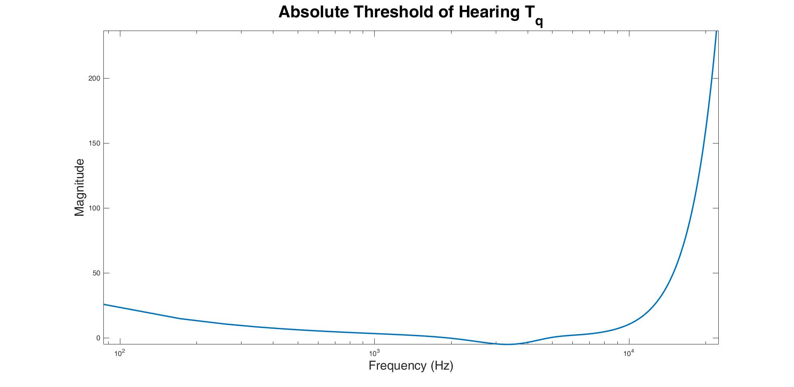{width="7.268055555555556in"
height="3.5430555555555556in"}

An $n$-point power spectrum $P(k)$ using $n=512$ samples is calculated. This is standard procedure for `MPEG-Layer-1`. To be more specific, the calculation uses the following formula: 

$$
P\left( k \right) = PN + 10\log_{10}\left| \sum_{n = 0}^{N - 1}{w\left( n \right)x(n)e^{- j\frac{2\pi\text{kn}}{N}}} \right|^{2},\ \ \ 0 \leq k \leq \frac{N}{2}
$$

where $w(n)$ is the Hanning window:

$$
w\left( n \right) = \frac{1}{2}\left\lbrack 1 - cos\left( \frac{2\pi n}{N} \right) \right\rbrack
$$

For the `MATLAB` implementation, we followed these steps:

1.  Using the `buffer` function, a window with length $L=512$  and zero overlap is applied to the signal `sig_final`.

2. Smooth the vector by convoluting it with a Hanning window, which is a tapering function that smoothes discontinuities at the beginning and end of the sampled signal: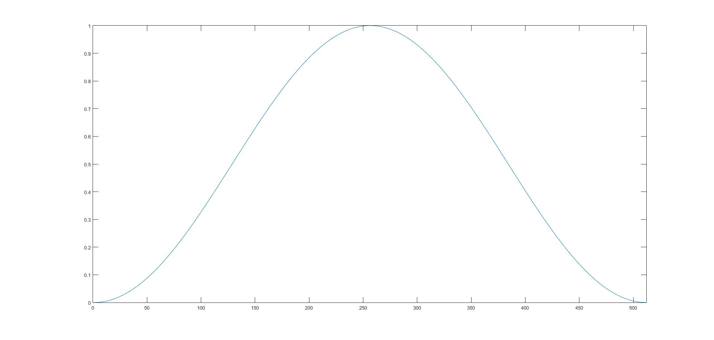{width="4.784645669291338in"
   height="2.706299212598425in"}

   Then, calculate the absolute value of the fft-transformed hanning-windowed signal.

4. Take the base-10 logarithm of the square of such fft transformations.

5. Add normalization constant $PN=90.302\text{dB}$

6. Keep only first $256=\frac{L}{2}$ samples from vector $P(k)$, since it is symmetrical.

Marker Localization
-------------------------------------------------------

Having calculated the power spectrum $P(k)$, we extract local maxima, i.e. maskers, per critical band. These correspond to values greater than those in their neighborhood by a margin no less that $7 \text{dB}$. The span of these regions depends on the discrete frequency $k$:
$$
\Delta_k\in \begin{cases} 
\begin{array}{ccc}
2, & 2<k<63 & (0.17-5.5\text{kHZ}) \\
 [2,3], & 63\leq k<127 & (5.5-11\text{kHZ}) \\
 [2,6], & 127\leq k<250 & (11-20\text{kHZ})
\end{array}
\end{cases}
$$
To extract the noise maskers of each window of the signal, the following function is put into use:

$$
[P_{NM}] = \texttt{findNoiseMaskers}(P, P_{TM}, b),
$$
where $P$ is the power spectrum of the window in question, $b$ is the bark scale defined before and $P_{TM}$ is the power of the masker at $k$, defined as:
$$
P_{TM}(k)= \begin{cases} 
\begin{array}{cc}
10\log_{10}(10^{0.1P(k-1)})+10^{0.1P(k)}+10^{0.1P(k+1)}(\text{dB}), & S_T(k)=1 \\
0, & S_T(k)=0
\end{array}
\end{cases}
$$
where:
$$
S_T= \begin{cases} 
\begin{array}{cc}
0, & k\notin[3,250] \\
P(k)>P(K\pm1) \land P(k)>P(k\pm\Delta_k)+7\text{dB} , & k\in[3,250]
\end{array}
\end{cases}
$$
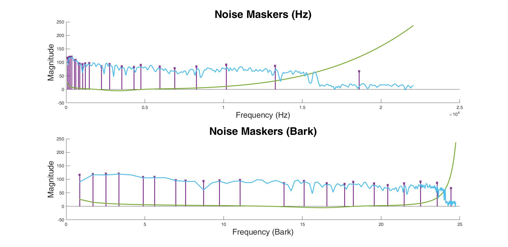{width="7.268055555555556in"
height="3.5430555555555556in"}

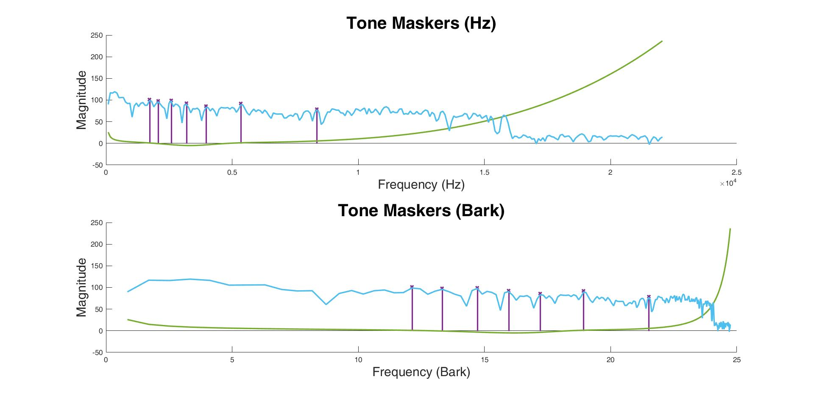{width="7.268055555555556in"
height="3.5430555555555556in"}

Masker reduction and reorganization
----------------------------------------------

To reduce the number of maskers and, thus, render the computations more tractable, we employ the out-of-the-box function:
$$
[P_{TM},P_{NM}]=\texttt{checkMaskers}(P_{TM},P_{NM},T_q,b)
$$
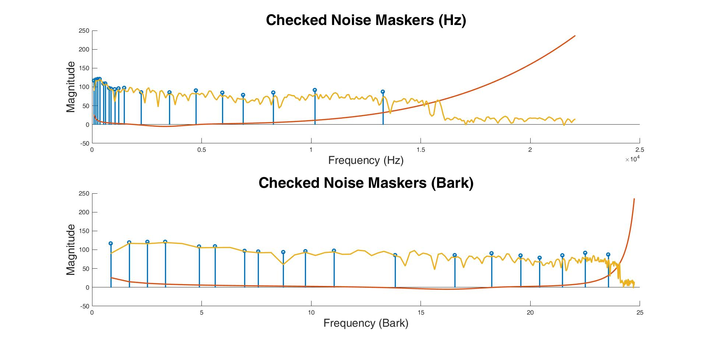{width="7.268055555555556in"
height="3.5430555555555556in"}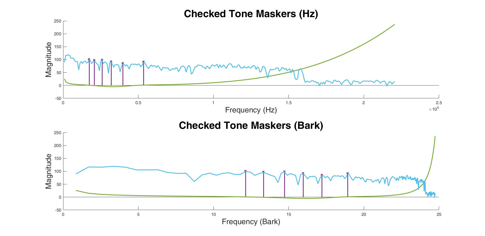{width="7.268055555555556in"
height="3.5430555555555556in"}

Calculation of 2 Individual Masking Thresholds
------------------------------------------------------------------------------------------

Having reduced the number of maskers, we are now able to calculate the two different masking thresholds. Each represents the masking percentage at point $i$ that corresponds to the tone or noise masker at point $j$. These thresholds are calculated via the following formulas:
$$
T_{TM}(i,j)=P_{TM}(i,j)-0.275b(j)+SF(i,j)-6.025 \text{ (dB SPL)}
$$

$$
T_{NM}(i,j)=P_{NM}(i,j)-0.175b(j)+SF(i,j)-2.025 \text{ (dB SPL)}
$$

where $P_{TM}(j)$ and $P_{NM}(j)$ correspond to the maskers' power (tone and noise respectively) at sample $j$ and $b(j)$ corresponds to the Bark frequency. The function $SF(i,j)$ calculates the masking span from $j$ to $i$: 
$$
SF(i,j)= \begin{cases} 
\begin{array}{lc}
17\Delta_b-0.4 P_{TM}(j)+11, & -3\leq \Delta_B<-1 \\
(0.4P_{TM}(j)+6)\Delta_b, & -1\leq \Delta_B<0 \\
-17\Delta_b, &  0\leq \Delta_B<1 \\
(0.15P_{TM}(j)-17)\Delta_b-0.15P_{TM}(j), &  1\leq \Delta_B<8 \\
\end{array}
\end{cases}
$$
The function $SF(i,j)$ approximates the lowest power level where the neighboring frequencies are perceivable by human ear. This function is calculated for each tone and noise masker. We assume that the masking is limited to a 12 bark region $b\left( i \right) \in \left\lbrack b\left( j \right) - 3,b\left( j \right) + 8 \right\rbrack.$ Also, $\Delta_{b} = b\left( i \right) - b(j)$.

Calculation Global Masking Threshold
--------------------------------------------------------------------------------

In order to calculate the global threshold at each discrete frequency, we combine all the aforementioned maskers:
$$
T_{g}\left( i \right) = 10\log_{10}\left( 10^{{0.1T}_{q}(i)} + \sum_{l = 1}^{L}10^{{0.1T}_{\text{TM}}(i,l)} + \sum_{m = 1}^{M}10^{{0.1T}_{NM}(i,m)} \right)\text{\ \ dB\ SPL}
$$

where $L, M$ are the number of tone and noise maskers respectively.

{width="7.268055555555556in"
height="3.5430555555555556in"}

# PART 2: Time-Frequency Analysis via bandpass filterbanks

In quantization and encoding of sound signals, some parameters are extracted using time-frequency analysis. Usually, a bandpass filterbank is employed, which spans the entire spectrum.  The spectrum is divided into zones and information pertaining the frequecny distribution is extracted and, consequently, enables recognizing the superfluous elements of the signal. Thus, the filterbank facilitates the psychoacoustic model analysis and significantly reduces the statistical redundancies via decomposing the signal to various frequency zones. An example of a sound encoder is presented below:

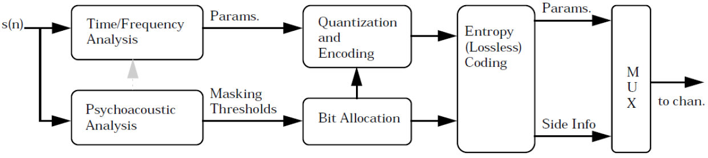{width="6.692913385826771in"
height="1.4937007874015749in"}

The windows $x(n)$ are processed via the array of analysis filters $h_k(n)$ and composition filters $g_k(n)$. The goal is to create a function that implements the processing depicted below and computes the reconstructed signal $\widehat{x}$  and the number of bits used for its creation.

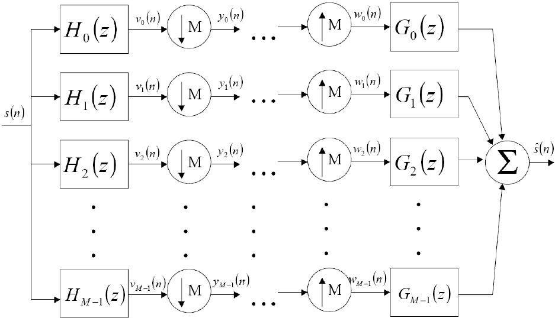{width="5.618897637795276in"
height="2.719291338582677in"}

Bandpass filterbank
----------------------------------------------------

The encoding and decoding of the compression system uses $M=32$ analysis and composition filters, whose impulse response is
$$
h_{k}\left( n \right) = sin\left\lbrack \left( n + \frac{1}{2} \right)\frac{\pi}{2M} \right\rbrack\sqrt{\frac{2}{M}}\cos\left\lbrack \frac{\left( 2n + M + 1 \right)\left( 2k + 1 \right)\pi}{4Μ} \right\rbrack
$$

and

$$
g_{k}\left( n \right) = h_{k}\left( 2M - 1 - n \right)
$$

where  $L=2M$ and $\sin\lbrack(n + \frac{1}{2})\frac{\pi}{2Μ}\rbrack$ for $0 \leq n \leq L - 1$ and $0 \leq k \leq M - 1$ (windowed sinusoid).

Analysis via an array of filters
--------------------------------------

The responses $v_k(n)$ are calculated as the convolution of each windowed signal using $N=512$ samples and the filter impulses $h_k(n)$. The `MATLAB` function `conv` is used. Next, the responses $y_k(n)$ are calculated via decimating $v_k(n)$:
$$
y_k(n)=v_k(Mn)
$$
where $M=32$ by using the `downsample` routine.

Quantization
----------------------

A quantizer is an integral part of every digital encoder. We implement an adaptive, uniform quantizer of $2^{\text{Βκ}}$ levels, where $B_k$ is the number of encoding bits per sample of the sequence $y_k(n)$ that corresponds to an analysis window of the original signal $x(n)$. The step, denoted as $\Delta$, adapts at eah window. The number of levels adapts so that the quantizing error is not perceivable by human ear after the compression of the music signal. The maximum error is a function of the global masking threshold $T_g(i)$:
$$
Β_{k} = \left\lceil \log_{2}\left( \frac{2^{16}}{T_{g}} \right) - 1 \right\rceil
$$
where $R$ is the number of quantizing levels of the original signal. The step $\Delta$ adapts based on $B_k$ and $[x_{min},x_{max}]$ of each window. For the adaptive quantizer, we have that:
$$
y_{\text{new}}(x) = \Delta \bullet \left\lfloor \frac{y(x)}{\Delta} + \frac{1}{2} \right\rfloor
$$

where $y_{new}(x)$ is th quantizer's output and $y$ is its input, i.e. the downsampled signal. In constrast, the non-adaptive quantizer uses 8 levels and $x_{min}$, $x_{max}$ are fixed.

Composition
-----------------

We calculate  $w_k(n)$, .i.e. the signals resulting from the interpolation of the quantized  $\widehat{y_{k}}$:
$$
w_k(n)=\begin{cases}
\begin{array}{ll}
\hat{y}_k(n/M)   & n=0,2M,3M,\dots\\
0, & \text{otherwise}
\end{array}
\end{cases}
$$
Then, the outputs pass through composition filters and the responses are added resulting to the output signal $\widehat{s(n)}$. The decomposition of the signal employes the method Overlap Add. The length of the singal is calculated as follows:

1.  Convolution of the signal with a filter of  $L=64$ samples resulting to a signal consisting of  $M+L-1=512+64-1=575$ samples.
2.  Decimation with $Μ=32$,
3.  Processing and quantization,
4.  Interpolation with a $Μ=32$. The resulting signal has a lenth equal to $576$ samples.
5.  Convolution of the signal with a filter of  $L=64$ samples resulting to a signal consisting of  $M+L-1=576+64-1=639$ samples.

Compression Ratio
-----------------

The original signal is encoded using $16$ bits per sample. Thus, the uniform, non-adaptive quantizer uses $8$ bits per sample and the compression ratio is:
$$
{\text{compression}\ \text{ratio}}_{non - adaptive,\ \ uniform} = 2.
$$

In order to calculate the compression ratio of the adaptive quantizer, a more involved process is required. To be more specific, each window uses a variable number of bits, denoted as $B_{k}$. Each window, thus, requires:

-   $16$ bits for $\Delta_{}$ ,

-   $16$ bits for the  minimum of each window, since it is a product of $16\text{bit}$ original signal,
    
-   $B_{k} \bullet L$, where L=18 is the length of the downsampled signal.

Thus, we use:

$$
\frac{\text{bits}}{\text{quantization}} = B_{k} \times L + \ 32\ \ \text{bits}
$$

The experiment yields

$$
{\text{compression}\ \text{ratio}}_{adaptive,non - uniform} = 1.3343
$$

As expected, the adaptive quantizer uses more bits to encode the original signal. Alternatively, we can observe that  $Β_{k} \geq 8$ $\forall k$.

Mean-Squared Error
----------------------

The experiments yield
$$
\text{mse}_{non - adaptive,\ \ uniform} = 0.0171
$$

$$
\text{mse}_{adaptive,non - uniform} = 2.418\  \times 10^{- 7}
$$

It becomes clear that the adaptive quantizer achieves a far lower error. This can be explained by the fact that signal is quantized using the values of the specific window and not by using the global minimum and maximum values. Also, the adaptive filter takes advantage of the psychoacoustic model by reducing the noise while maintaining the important information. The results are easily interpreted by the following figures and, especially, by the error visualization (note the y-axis values).

Wavelength Visualization
--------------------

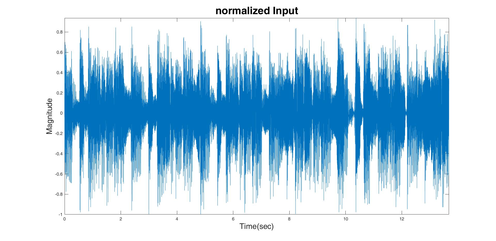{width="7.020833333333333in"
height="3.42253937007874in"}

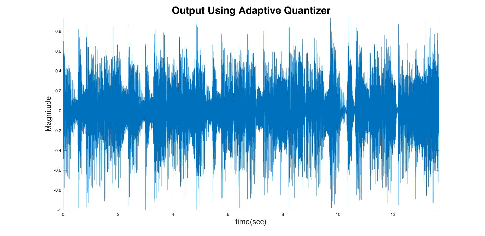{width="7.020833333333333in"
height="3.42253937007874in"}

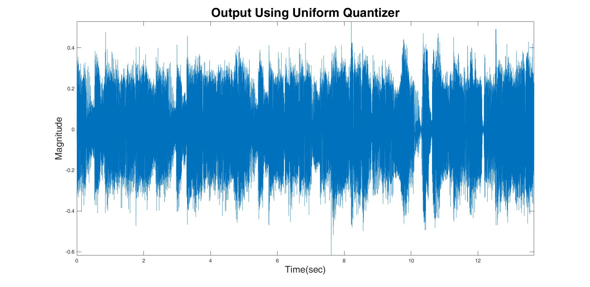{width="7.01163823272091in"
height="3.4180555555555556in"}

Error Visualization
-----------------

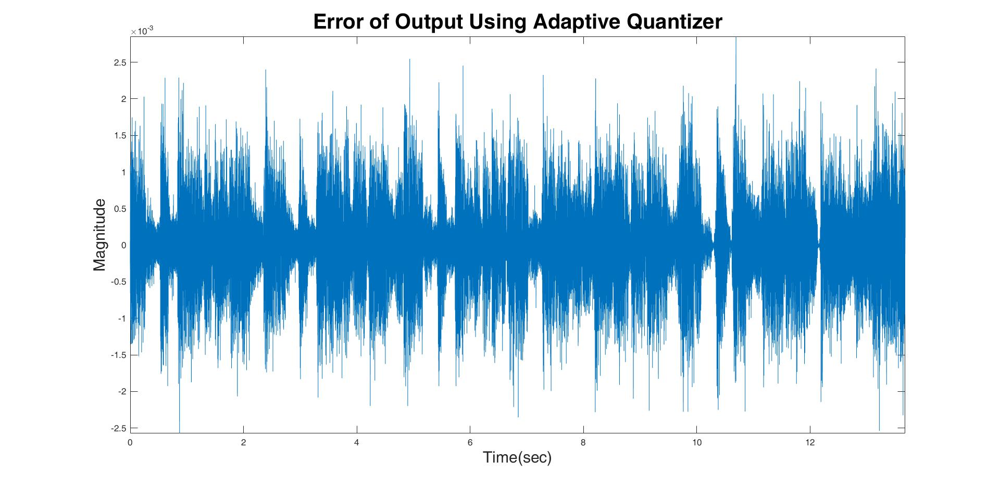{width="7.268055555555556in" height="3.5430555555555556in"}
-----------------------------------------------------------------------------------------

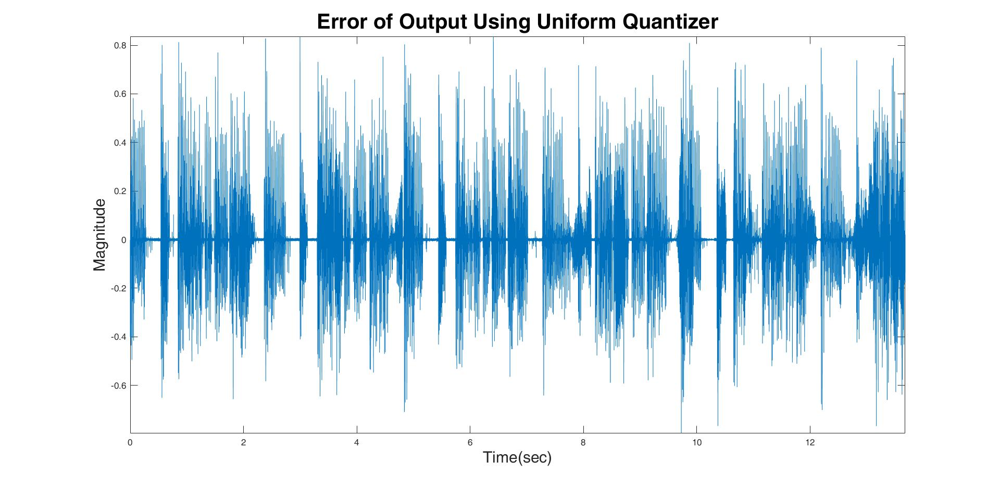{width="7.268055555555556in" height="3.5430555555555556in"}
-----------------------------------------------------------------------------------------
